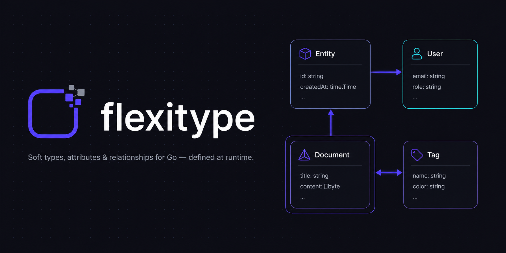

<p align="center">
  
</p>

# flexitype

[](https://github.com/zkrebbekx/flexitype/actions/workflows/ci.yml)
[](https://github.com/zkrebbekx/flexitype/releases)
[](https://pkg.go.dev/github.com/zkrebbekx/flexitype)
[](LICENSE)

Soft types and attributes for Go: define entity types, typed and constrained
attributes, and attribute dependencies at **runtime** — then attach validated
values to your own domain objects. Inspired by PLM-class flexible attribute
systems, built as a production-grade DDD Go service.

> **Versioning.** Releases are tagged (`vX.Y.Z`) with a
> [CHANGELOG](CHANGELOG.md); pin a version rather than tracking `main`. The
> project is pre-1.0 — see [API stability](docs/api-stability.md) for what
> that guarantees. Embed with `go get github.com/zkrebbekx/flexitype@vX.Y.Z`,
> or grab a standalone binary from
> [Releases](https://github.com/zkrebbekx/flexitype/releases).

Runs two ways from one codebase:

- **Embedded library** — wire it into your service over your own `*sqlx.DB`
- **Standalone service** — a single binary with a versioned REST API,
  service-account auth, OpenTelemetry and health endpoints

**[▶ Try the playground](https://zkrebbekx.github.io/flexitype/)** — the full
service (usecases, REST API, FQL, GraphQL, search index, schema templates)
compiled to WebAssembly, running the admin console entirely in your browser.
No backend; data resets on reload.

## Features

- **Soft types**: `TypeDefinition` → `AttributeDefinition` → `AttributeValue`,
  anchored to *your* entities via an opaque `entity_id`
- **14 data types**: bool, string, integer, float, decimal (arbitrary
  precision), date, time, datetime, enum, url, email, json, **media** (files
  backed by a blob store), **quantity** (a magnitude in a unit family)
- **Constraints**: min/max length, min/max value, RE2 pattern, one-of, media
  (allowed MIME types + max size), plus required / multi-valued / unique
  attribute flags
- **Localized & scoped values**: mark an attribute *localizable* and/or
  *scopable* and hold a distinct value per locale and channel; single-valued
  uniqueness and FQL filtering apply per scope, and a query can pin one
  (`GET /query?locale=fr&channel=web`)
- **Computed attributes**: derive a value from a formula over other
  attributes (`(price - cost) / price`) — materialized by an event subscriber
  so the result is an ordinary, FQL-queryable value that stays in sync
- **Units of measure**: a `quantity` attribute pins a tenant *unit family*
  (mass, length, …) with per-unit conversion factors; values normalize to a
  base unit so `weight > 5.5 kg` compares `6000 g` correctly, and min/max
  constraints normalize too. `/api/v1/unit-families`
- **Media attributes**: upload files against a `media` attribute through a
  pluggable blob store (local disk or in-memory; S3/MinIO drop-in), with MIME
  and size limits and blob GC on archive.
  `POST /api/v1/entities/{type}/{entity}/attributes/{attr}/media`
- **Attribute dependencies**: cascading picklists and conditional validation —
  when a source attribute matches conditions (equals / in / range / pattern /
  dynamic time), the target's allowed values narrow, constraints tighten or
  required flips; resolve the *effective schema* per entity for building UIs
- **Dynamic values**: `now` / `today` / relative-time defaults and conditions
- **Domain events**: aggregates return `[]events.Event`; a dispatcher fans a
  stable JSON envelope out to **your** infrastructure — pub/sub brokers,
  HMAC-signed webhooks, or plain funcs
- **Activity log**: every change audited with JSON before/after descriptors,
  written in the *same transaction* as the change
- **Data erasure**: an admin-scoped, audited, irreversible hard delete of one
  entity or a tenant's entity data — the right-to-erasure primitive on top of
  everyday soft deletes. See [docs/erasure.md](docs/erasure.md)
- **Dataloaders throughout the repositories**: point lookups batch into
  `ANY()` queries, identical filter+page queries deduplicate, per-parent
  pagination collapses into one windowed query
- **Type inheritance**: single-inheritance hierarchies (`MountainBike
  extends Bike extends Product`) — subtypes inherit every attribute,
  constraint and dependency; no shadowing anywhere in a hierarchy; values
  anchor to the entity's declared type; uniqueness applies hierarchy-wide;
  dependencies and relationships work across levels
- **Relationships between types**: user-defined relationship types —
  **directed** (a parent side and a child side, optional display role
  labels like "assembly"/"component", per-link version binding: track the
  latest type version or pin one) or **symmetric** (unordered peers such
  as `compatible_with`; the pair is stored canonically so `A↔B` can never
  duplicate as `B↔A`). Both carry their own attributes and constraints
  (the full attribute machinery applies to links), support definition
  inheritance, and enforce optional **cardinality** bounds (min/max children
  per parent and parents per child).
- **FQL, a schema-aware query language**: query entities by attribute
  values and across relationships — `category = "bike" and (min(price) >=
  500 or "sale" in tags) and child(supplied_by) { link.lead_time_days <=
  14 }`. Comparisons, `in`, `range`, `has`, `length`, `min`/`max`/`count`,
  case-insensitive string matching, `and`/`or`/`not` with parentheses,
  `type isa` hierarchy matching; `child()`/`parent()` traverse directed
  relationships, `linked()` matches either end (the only traversal for
  symmetric ones). Names bind against the (inherited) schema with
  positioned errors; archived types, attributes and entities are
  invisible. See `docs/design/query-language.md`.
- **GraphQL read API**: a read-only `/api/v1/graphql` whose schema is generated
  from your live type definitions — each type an object, each attribute a
  field, each relationship a nested **Relay connection** (edges/node/cursor,
  `pageInfo`, on-demand `totalCount`), with FQL exposed as a `filter` argument.
  Relationship fields resolve through the dataloaders (no N+1), the schema
  regenerates on definition events, and introspection reflects only the
  caller's readable types.
- **Faceted grid & saved views**: project chosen attributes as columns
  (`/entities/{type}/grid`), get value counts over the current result set
  (`/entities/{type}/facets`), and persist a type + query + columns as a named
  **saved view** (`/api/v1/saved-views`).
- **CSV import & export**: bulk-load entities from tabular data with column
  mapping, a dry-run validation report, and best-effort or all-or-nothing
  modes; export honours the active FQL query.
  `POST|GET /api/v1/entities/{type}/import|export`
- **Duplicate detection**: per-type match rules (exact, case-insensitive or
  trigram with a threshold) produce scored candidate pairs; dismissals stick.
  Scoring runs in Go so both backends agree. `/type-definitions/{id}/match-rules`
- **Completeness scoring**: score an entity (or a whole type) against its
  effective, dependency-adjusted required schema.
  `/entities/{type}/{entity}/completeness`
- **Entity revisions**: capture immutable point-in-time value snapshots, list
  and diff them, read an entity *as of* a timestamp, and restore a revision
  (which replays as normal writes, so events and activity fire).
  `/entities/{type}/{entity}/revisions`, `/revisions/{id}`
- **Change management**: stage a batch of value edits as a **change-set**
  (draft → in-review → approved → published), preview the result against live
  data without touching it, require a distinct approver, and publish now or on
  a schedule. `/api/v1/changesets`
- **Field-level access control**: per-attribute read/write permissions on a
  service account gate the write path, value reads, effective-attributes and
  the FQL binder — an unreadable attribute is invisible rather than leaked.
- **Schema templates & type cloning**: bootstrap a tenant from curated,
  in-repo starter schemas (`/api/v1/schema/templates`), or clone an existing
  type's attributes, constraints and dependencies as a fresh root
  (`POST /type-definitions/{id}/clone`). Both reuse the portable, name-keyed
  schema bundle from import/export.
- **Keyset cursor pagination**: every list pages with an opaque keyset cursor
  (not offset), so pages stay stable under concurrent inserts and deletes — no
  skipped or duplicated rows. The total is computed only when asked for
  (`?total=true`, or the GraphQL `totalCount` field).
- **Transactional outbox** (optional): event envelopes persist in the same
  transaction as the change and a relay dispatches them with retries —
  at-least-once delivery for every hook (webhooks, pub/sub, the search
  indexer). `FLEXITYPE_OUTBOX=true` or `flexitype.WithOutbox()` +
  `Service.RunOutboxRelay`.
- **Event delivery for other services** (with the outbox): managed webhook
  subscriptions (`/api/v1/webhook-subscriptions`) with signed deliveries,
  exponential backoff, dead-lettering and redrive; plus a cursor-paged
  events feed (`/api/v1/events`), an SSE live tail and named
  compare-and-swap cursors so replicated consumers read as one. Safe with
  any number of flexitype replicas. Design: `docs/design/event-delivery.md`.
- **Google Cloud Pub/Sub publisher** (optional): every event as one
  Pub/Sub message with filterable attributes and optional per-aggregate
  ordering keys — the preferred integration when consumers live on GCP.
  `FLEXITYPE_PUBSUB_PROJECT` (+ `_TOPIC`, `_ORDERING`) standalone, or the
  `infrastructure/gcppubsub` handler when embedding.
- **Search index** (optional): an event-driven projection keeps one
  searchable document per entity, unlocking FQL `matches("free text")` and
  `POST /api/v1/search/reindex`; trigram indexes accelerate
  `contains`/`icontains` everywhere. `FLEXITYPE_FEATURE_SEARCH_INDEX=true`
  or `flexitype.WithSearchIndex()`. Design:
  `docs/design/search-indexing.md`.
- **Feature toggles**: search and activity history switch off per
  deployment (`FLEXITYPE_FEATURE_SEARCH`, `FLEXITYPE_FEATURE_ACTIVITY`, or
  `flexitype.WithoutSearch()` / `WithoutActivityLog()` when embedding);
  the console adapts automatically.
- **Admin console**: a built-in Vue 3 UI at `/` for modelling types,
  attributes, dependencies and relationships (including from a template or by
  cloning), browsing entities with a faceted, column-configurable grid and
  dependency-aware value editing (localized/scoped values, media upload,
  computed and unit-of-measure fields), running FQL and a GraphQL explorer,
  managing saved views, duplicates, revisions and change-sets, and auditing
  every change with before/after diffs
- **Multi-tenant** from day one; **definition versioning** with values pinned
  to the version they were validated against

## Architecture

```
domain/          Aggregates, value objects, constraints, events, repo ports
application/     Usecases (interactors) — types, attributes, values, query,
                 relationships, schema, dedup, revision, changeset, unit,
                 computed, search, gql — plus the common factory, unit of
                 work, activity log contract, actor/tenant context
infrastructure/  PostgreSQL + in-memory repositories (dataloader-backed),
                 migrations, activity log, embedded migration runner
internal/.../http REST + GraphQL API for the standalone service
pkg/             Reusable primitives: ulid, db (Transactor + commit hooks,
                 keyset pagination), dataloader, events (dispatcher + hooks),
                 blob (media store), fql, formula, ratelimit, metrics,
                 safedial, serviceaccount, logger, config, telemetry, health
cmd/flexitype    Composition root for the standalone service (+ -wasm playground)
flexitype.go     Embedding facade
client/          First-party Go REST client (separate, stdlib-only module)
```

Every write flows through the **unit of work**: the usecase opens the
transaction, repositories join it (`WithTx`, `GetForUpdate` row locks), and
the common factory registers three commit handlers —

1. **pre-commit** → activity-log rows written inside the transaction
2. **post-commit** → domain events dispatched to your hooks (only after the
   change is durable)
3. **rollback** → observability hook

## Embedded usage

```go
import (
    "github.com/jmoiron/sqlx"
    _ "github.com/lib/pq"

    "github.com/zkrebbekx/flexitype"
    "github.com/zkrebbekx/flexitype/pkg/events"
)

pool, _ := sqlx.Connect("postgres", dsn)

svc := flexitype.New(pool,
    // Route events into your broker (NATS, Kafka, SNS, ...).
    flexitype.WithPublisher("nats", myNATSPublisher, nil),
    // Or deliver signed webhooks.
    flexitype.WithWebhook("billing", events.WebhookConfig{
        URL:    "https://billing.internal/hooks/flexitype",
        Secret: os.Getenv("HOOK_SECRET"),
    }),
    // Or just run a func.
    flexitype.WithHandlerFunc("cache-invalidator", func(ctx context.Context, env events.Envelope) error {
        cache.Invalidate(env.AggregateID)
        return nil
    }, events.WithEventTypes(value.EventUpdated)),
)

_ = svc.Migrate(ctx) // embedded migrations, advisory-locked, idempotent

// One interactor set per request/unit of work (fresh dataloader caches).
interactors := svc.Interactors(ctx)
product, _ := interactors.TypeDefinitions().Create(ctx, typedef.CreateInput{
    InternalName: "product",
    DisplayName:  "Product",
})
```

For tests and prototypes, `flexitype.NewInMemory(...)` takes the same
options and runs the identical usecases over an in-process store — no
database, no migrations. It powers the browser playground and makes a
zero-dependency test double for embedding consumers.

Consumers on other stacks integrate via the standalone service's REST API and
webhooks; every subscriber sees the same envelope:

```json
{
  "id": "01J...",
  "type": "flexitype.attribute_value.updated",
  "aggregate_type": "attribute_value",
  "aggregate_id": "01J...",
  "tenant_id": "acme",
  "actor": "service_account:ci-importer",
  "occurred_at": "2026-07-11T10:00:00Z",
  "recorded_at": "2026-07-11T10:00:00.003Z",
  "schema_version": 1,
  "payload": { "old_value": "SN-100", "new_value": "SN-200", "...": "..." }
}
```

Webhook deliveries carry `X-Flexitype-Signature` (hex HMAC-SHA256 of the
body); verify with `events.VerifySignature`.

## Quickstart (Docker)

One command brings up the service (admin console embedded) and Postgres,
with the transactional outbox and entity search index enabled:

```bash
docker compose up --build
# then open http://localhost:8080
```

The published image is available without cloning:

```bash
docker pull ghcr.io/zkrebbekx/flexitype:latest
```

For a realistic, end-to-end scenario — a PLM-style product catalog with
inheritance, a cascading dependency, FQL and a signed webhook consumer —
see [`examples/catalog`](examples/catalog/) (`docker compose up` + a seed
script).

## Standalone service

```bash
go build -o flexitype ./cmd/flexitype
FLEXITYPE_DB_HOST=localhost FLEXITYPE_DB_NAME=flexitype ./flexitype
```

Configuration is environment-driven (`FLEXITYPE_PORT`, `FLEXITYPE_DB_*`,
`FLEXITYPE_SERVICE_ACCOUNTS`, `FLEXITYPE_WEBHOOK_URL`/`_SECRET`,
`FLEXITYPE_OUTBOX`, `FLEXITYPE_EVENT_RETENTION`, `FLEXITYPE_METRICS`,
`FLEXITYPE_FEATURE_SEARCH_INDEX`, `FLEXITYPE_BLOB_DIR` (media storage),
`FLEXITYPE_MIGRATE_ON_START`, `FLEXITYPE_LOG_LEVEL`) — every variable is
tabulated in [docs/configuration.md](docs/configuration.md). Tracing
follows the standard `OTEL_EXPORTER_OTLP_ENDPOINT`. Liveness at
`/healthz`, readiness (with a database probe) at `/readyz`.

Prometheus metrics are served at `/metrics` (unauthenticated;
`FLEXITYPE_METRICS=false` to disable): `flexitype_http_requests_total` and
`flexitype_http_request_duration_seconds` labelled by method, route
pattern and status class, plus Go/process collectors. With the outbox on,
scrape-time gauges `flexitype_outbox_pending` and
`flexitype_webhook_deliveries{status}` report delivery depth. Embedding
consumers pass a `*metrics.Metrics` to `APIConfig`.

### Consuming events from another service

With `FLEXITYPE_OUTBOX=true`, other services subscribe over the API — no
broker, no SDK. Register an endpoint:

```bash
curl -X POST /api/v1/webhook-subscriptions -d '{
  "name": "billing",
  "url": "https://billing.internal/hooks/flexitype",
  "secret": "s3cret",
  "event_types": ["flexitype.attribute_value.set", "flexitype.attribute_value.updated"]
}'
```

Subscription URLs must be **public https** endpoints: the service rejects
private, loopback and link-local targets at registration and again at dial
time (the delivery worker resolves the host and blocks non-public
addresses, defeating DNS rebinding) — an SSRF guard. On-prem deployments
whose consumers live on internal networks set
`FLEXITYPE_WEBHOOK_ALLOW_PRIVATE=true` (or `flexitype.WithWebhookAllowPrivate()`)
to allow http and private hosts.

Every matching envelope arrives as a signed POST, retried with exponential
backoff and dead-lettered (with API redrive) after ~3 days of failures.
The receiving handler needs three things:

1. **Return 2xx fast; process async.** Anything else retries.
2. **Verify the signature** — `events.VerifyRequest(secrets,
   r.Header.Get(events.HeaderTimestamp), body,
   r.Header.Get(events.HeaderSignature), events.DefaultSignatureTolerance,
   time.Now())` checks the HMAC and rejects replays.
3. **Dedupe on the envelope `id`** (`INSERT ... ON CONFLICT DO NOTHING`
   into a processed-events table). Delivery is at-least-once by design;
   this one rule makes N flexitype replicas × M consumer replicas safe.

Pull consumers use the ordered feed instead: `GET /api/v1/events?after=
<cursor>` pages expanded events (`GET /api/v1/events/stream` is the SSE
live tail, resuming via `Last-Event-ID`), and named cursors
(`PUT /api/v1/event-cursors/{consumer}` with `{"position": n, "expected":
m}`) commit progress with compare-and-swap, so replicated consumers read
as one logical consumer. Cursors older than `FLEXITYPE_EVENT_RETENTION`
(default 7 days) get `410 CURSOR_EXPIRED` — re-baseline instead of
silently missing events. Full design: `docs/design/event-delivery.md`.

Consumers on GCP should prefer **Pub/Sub**: set
`FLEXITYPE_PUBSUB_PROJECT` (topic via `FLEXITYPE_PUBSUB_TOPIC`, default
`flexitype-events`; per-aggregate ordering keys via
`FLEXITYPE_PUBSUB_ORDERING=true`) and every event publishes as one
message — envelope JSON as the body, attributes (`event_type`,
`tenant_id`, `aggregate_id`, ...) for server-side subscription filters.
Pub/Sub then provides consumer groups, replay and dead-letter topics
natively; dedupe on the `event_id` attribute as with every other lane.
Embedded services register the same handler directly:
`flexitype.WithHandler(gcppubsub.New("gcp-pubsub", client.Publisher("flexitype-events")))`.

### Service accounts

Machine-to-machine auth via bearer tokens (`ft_<account>_<secret>`), accounts
declared in a JSON file with SHA-256 secret hashes and `read`/`write`/`admin`
scopes; each account is pinned to a tenant:

```json
[
  {
    "id": "ci",
    "name": "CI Importer",
    "tenant_id": "acme",
    "scopes": ["read", "write"],
    "secret_hash": "<hex sha256 of the secret>"
  }
]
```

No file configured → auth disabled (development mode).

### REST API (v1)

The full contract is published as OpenAPI 3 — committed at
[`api/openapi.yaml`](api/openapi.yaml) and served (unauthenticated) at
`/api/v1/openapi.json` and `/api/v1/openapi.yaml`.

**Go services** get a first-party, hand-crafted client at
[`github.com/zkrebbekx/flexitype/client`](client) — a standard-library-only
module that mirrors the embedded usecase surface over the network, with keyset
pagination iterators and typed errors:

```go
c, _ := client.New("https://flexitype.internal", client.WithToken(tok))
prod, _ := c.Types().Create(ctx, client.CreateTypeInput{InternalName: "product", DisplayName: "Product"})
for row, err := range c.Query(ctx, "product", `price > 100`) { /* ... */ }
if errors.Is(err, client.ErrNotFound) { /* ... */ }
```

For other languages, generate a client from the OpenAPI document. Both are
covered in [docs/clients.md](docs/clients.md).

```
GET|POST   /api/v1/type-definitions            PATCH /api/v1/type-definitions/{id}
POST       /api/v1/type-definitions/{id}/archive|restore
POST       /api/v1/type-definitions/{id}/clone
GET        /api/v1/type-definitions/{id}/attributes
GET        /api/v1/type-definitions/{id}/effective-attributes
GET        /api/v1/type-definitions/{id}/children
GET        /api/v1/type-definitions/{id}/completeness
GET|POST   /api/v1/type-definitions/{id}/match-rules
GET|POST   /api/v1/attributes                  PATCH /api/v1/attributes/{id}
POST       /api/v1/attributes/{id}/archive|restore
POST       /api/v1/attributes/{id}/validate-value
GET|POST   /api/v1/values                      GET|DELETE /api/v1/values/{id}
POST       /api/v1/values/batch
GET        /api/v1/entities/{typeDef}                (list)
GET        /api/v1/entities/{typeDef}/grid|facets    (faceted grid)
POST|GET   /api/v1/entities/{typeDef}/import|export  (CSV)
GET        /api/v1/entities/{typeDef}/{entity}/values|completeness|as-of
DELETE     /api/v1/entities/{typeDef}/{entity}                 (archive, cascade)
POST       /api/v1/entities/{typeDef}/{entity}/purge           (erase, admin, hard delete)
GET        /api/v1/entities/{typeDef}/{entity}/attributes/{attr}/effective-schema
POST       /api/v1/entities/{typeDef}/{entity}/attributes/{attr}/media
GET|POST   /api/v1/entities/{typeDef}/{entity}/revisions
GET        /api/v1/revisions/{id}              GET /api/v1/revisions/{id}/diff  POST .../restore
GET        /api/v1/media/{objectKey}
GET|POST   /api/v1/dependencies                PATCH|DELETE /api/v1/dependencies/{id}
GET|POST   /api/v1/unit-families               GET|DELETE /api/v1/unit-families/{id}
GET|POST   /api/v1/saved-views                 GET|PATCH|DELETE /api/v1/saved-views/{id}
GET|POST   /api/v1/changesets/...              (submit|approve|reject|publish|mutations)
GET        /api/v1/schema/export|templates     POST /api/v1/schema/import|templates/{name}/apply
GET        /api/v1/features
GET        /api/v1/query?type=&q=&locale=&channel=&total=   POST /api/v1/query/validate
GET|POST   /api/v1/graphql                     (read-only, schema from your types)
POST       /api/v1/search/reindex
GET|POST   /api/v1/relationship-definitions    PATCH /api/v1/relationship-definitions/{id}
POST       /api/v1/relationship-definitions/{id}/archive|restore
GET        /api/v1/relationship-definitions/{id}/attribute-sets
GET|POST   /api/v1/relationships               GET|DELETE /api/v1/relationships/{id}
GET        /api/v1/entities/{typeDef}/{entity}/relationships
GET        /api/v1/match-rules/{id}/scan|dismiss                (duplicate detection)
GET        /api/v1/activity
POST       /api/v1/admin/purge                 (erase tenant entity data, admin, hard delete)
GET|POST   /api/v1/webhook-subscriptions       GET|PATCH|DELETE /api/v1/webhook-subscriptions/{id}
GET        /api/v1/webhook-subscriptions/{id}/deliveries?status=
POST       /api/v1/webhook-deliveries/{id}/redeliver
GET        /api/v1/events?after=&types=        GET /api/v1/events/stream (SSE)
GET|PUT    /api/v1/event-cursors/{consumer}
```

Lists paginate with `?limit=` and an opaque, keyset **`?cursor=`** (stable
under concurrent writes); the total count is computed only when asked
(`?total=true`). Bad pagination params (a non-positive limit, a malformed
cursor) return `422` uniformly. Errors carry stable machine codes
(`VALIDATION`, `NOT_FOUND`, `CONFLICT`, `ARCHIVED`, `DEPENDENCY_VIOLATION`,
`FORBIDDEN`, `RATE_LIMITED`).

## Example: cascading picklist

```bash
# category: enum(bike, car)      subcategory: enum(mountain, road, sedan, suv)
curl -X POST :8080/api/v1/dependencies -d '{
  "source_attribute_id": "'$CATEGORY'",
  "target_attribute_id": "'$SUBCATEGORY'",
  "conditions": [{"kind": "equals", "value": {"type": "enum", "value": "bike"}}],
  "effect": {"allowed_values": [
    {"type": "enum", "value": "mountain"},
    {"type": "enum", "value": "road"}
  ]}
}'

# With category=bike set on product-9, the UI asks what subcategory may be:
curl :8080/api/v1/entities/$TYPE/product-9/attributes/$SUBCATEGORY/effective-schema
# → {"required":false,"restricted":true,"allowed_values":["mountain","road"], ...}
```

## Admin console

The standalone service ships a built-in admin console at `/` (the API stays
under `/api/v1`). Develop it with the Go service running:

```bash
cd web && npm ci && npm run dev   # http://localhost:5173, proxies /api
```

Production builds embed the console into the binary: `npm run build` in
`web/`, then `go build ./cmd/flexitype`. A committed stub keeps `go build`
working without Node.

## Development

```bash
go build ./...   # everything compiles without a database
go test ./...    # goconvey Given/When/Then suites
go vet ./...
cd web && npm test && npm run build   # console tests + typecheck + bundle
```

Storage is a single polymorphic value table with one typed, indexed column
per storage class — no table-per-type explosion, uniqueness probes stay
index-backed, and entity hydration is one composite-index scan.

## License

MIT
